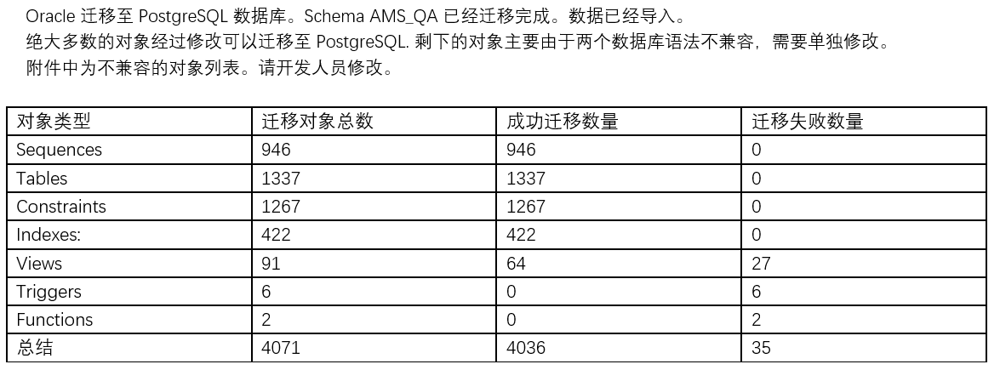

# 去oracle转向PostgreSQL

## 背景&目标
去IOE的背景不用多说了, 列举下团队对oracle使用的最不佳实践吧.
 
1. 文件直接存blob clob字段 
2. 用表的字段控制流程 
3. 一味的给表增加字段, 而不是花时间做好数据库设计
4. 核心业务没有分库分包, 应用程序看似服务化但是数据库还是单一化

## 选型
替代方案考虑过mysql, 阿里云产品, 最后定下来用PostgreSQL. 

原因: 

1. pgsql有DBA支持, 可以帮忙同步数据库结构和数据 
2. pgsql与oracle使用差异不是太大

各数据库都有自己的优势 劣势,可以结合自身原因选择

## 执行
### 运维侧
运维负责将oracle的数据库结构与数据迁移到pgsql, 使用的工具为EDB Migration Toolkit（EDB MTK） 

#### 迁移数据库中遇到的问题

Oracle 迁移至（PostgreSQL ）简称 PG. 有些地方两个数据库行为不一致。
测试程序的时候，需要注意这些修改的地方。
 
1. Oracle 默认访问的对象都是大写的，PG数据库默认对象都是小写的。
迁移过后，所有的表对象都自动转换成小写的。
 
2.Oracle中有一个函数sysdate
 
The Oracle SYSDATE function returns the current date and time of the Operating System (OS) where the Oracle Database installed.
Oracle:
select sysdate from dual;
2020-03-13 23:53:38
 
但是PG中没有这个函数：使用了这个函数替换。timestamp
PG 时间默认显示为：日期+时间+时区
PG
postgres=# select current_timestamp ;
       current_timestamp
-------------------------------
      2020-03-13 11:50:37.920059-04
 
PG表定义示例：
显示的时间比以前，多了微秒的显示。
create table t1 (id int,datetest timestamp without time zone );
insert into t2 values (1,current_timestamp); 
postgres=# select * from t2;
id |          datetest
----+----------------------------
  1 | 2020-03-13 12:08:36.542552
 
使用这个函数的表，大概有300张表。详情见附件。
 
3. 关于大对象数据。Oracle 中CLOB.  PG 中没有CLOB，使用的是TEXT 数据类型替换CLOB.
区别就是：Oracle 中CLOB 一条记录最大存4GB. PG TEXT 最大存1GB的数据。
 
这样的表大概有50张。 详情见附件。
 
4. 关于分区表：
Oracle 中支持这样的写法：
绿色的部分表示：如果分区表的分区键，插入了空值。就放在最后一个分区。
 
#### 迁移报告

### 研发侧

### 踩坑&经验

## 资料