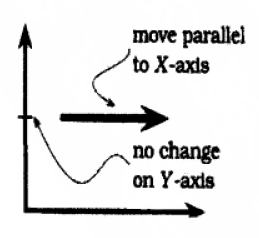

## 活动微服务化
> 参考程序员修炼之道-正交性 章节

每个人都知道要做什么, 不再老是争吵, 不必每一个改动都需要整改团队开一次会(因为并不是他们每一人都可能受影响)

---
## crawler python
使用scrapy  scrapinghub  scrapyd  让开发爬虫能站在巨人的肩上
但crawler python只负责爬, 与商店的业务完全隔离, 类似于爬取数据的特种部队
---
## 应用商店防爬(学习华为)
爬与被爬, 被爬永远都是被动的,除了封IP/UA 验证码等等的技术手段,结合业务防爬也是有效的方案
1. 不规则的无意义的应用ID
1. 不暴露应用的特有属性(packageName)
1. 网页只展示有价值的应用
---
## 语法糖
> 语法糖(Syntactic sugar),是由Peter J. Landin(和图灵一样的天才人物，是他最先发现了Lambda演算，由此而创立了函数式编程)创造的一个词语，它意指那些没有给计算机语言添加新功能，而只是对人类来说更“甜蜜”的语法。
---
## Lamda
    (参数) ->单行语句；
    (参数) ->{多行语句}；
    (参数) ->表达式；

1. 括号（）可以大致理解为就是方法，里面是参数变量，在上面的例子中()->System.out.println("Hello World!") 前面的()代表void lMethod()方法，它没有入参，所以为空，->后面是一个单行语句；　　
1. 如果->后面是多行语句，需要用{ }装起来，每条语句后需要有分号;　　
1. ->后面也可以是一个表达式，如：a+b等。
1. 首先在()中定义此表达式里面需要接收变量s，后面的单行语句中就可以使用该变量了
`test((s)->System.out.println(s));`
1. 首先在()中定义此表达式里面需要接收变量s，后面的多行语句中就可以使用该变量了。注意：多行语句别少“；”号
`test((s)->{s=s+s;System.out.println(s);});`
1. `test((x,y)-> x*y );`相当于`test((x,y)-> {return x*y;});`
1. 利用Lamda表达式是为了避免匿名内部类定义过多无用的操作
`new Thread(()->System.out.println("线程操作！"));`
---
## 网络爬虫项目不在黑盒
1. 爬虫的通用架构
1. 爬虫的工具箱:调度 代理池 验证码破解
---
## 限流系统的设计
> 高并发系统时有三把利器用来保护系统：缓存、降级和限流

限流方式 
1. 限制总并发数（比如数据库连接池、线程池） 
1. 限制瞬时并发数（如nginx的limit_conn模块，用来限制瞬时并发连接数）
1. 限制时间窗口内的平均速率（如Guava的RateLimiter、nginx的limit_req模块，限制每秒的平均速率）
1. 限制远程接口调用速率
1. 限制MQ的消费速率。
1. 可以根据网络连接数、网络流量、CPU或内存负载等来限流

> Guava 中提供了RateLimiter类，它经常用于限制对一些物理资源或者逻辑资源的访问速率。(http://ifeve.com/google-guava/)

> 分布式限流最关键的是要将限流服务做成原子化,而解决方案可以使使用redis+lua或者nginx+lua技术进行实现
---
## log4j2 实践出真理
例子: https://github.com/alvingj/log4j2_learning
关键点
1. 按日志级别归档
1. 格式化字符串
`logger.debug("Logging in user %1$s with birthday %2$tm %2$te,%2$tY", user.getName(), user.getBirthdayCalendar());`
---
### APK签名
为什么?  APK被篡改

是什么?  开发者对APK签名, 安装时对APK进行校验

怎么做? 
1. V1: JAR签名是在apk文件中添加META-INF目录，即需要修改数据区、中央目录，因为添加文件后会导致中央目录大小和偏移量发生变化，还需要修改中央目录结尾记录
1. V2 :  V2方案为加强数据完整性保证，不在数据区和中央目录中插入数据，选择在 数据区和中央目录 之间插入一个APK签名分块，从而保证了原始zip（apk）数据的完整性
---
