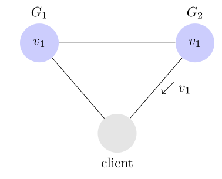
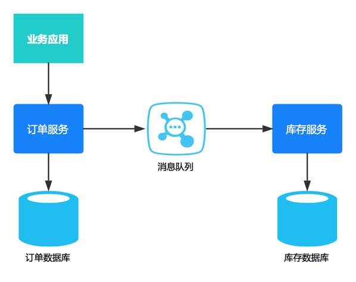
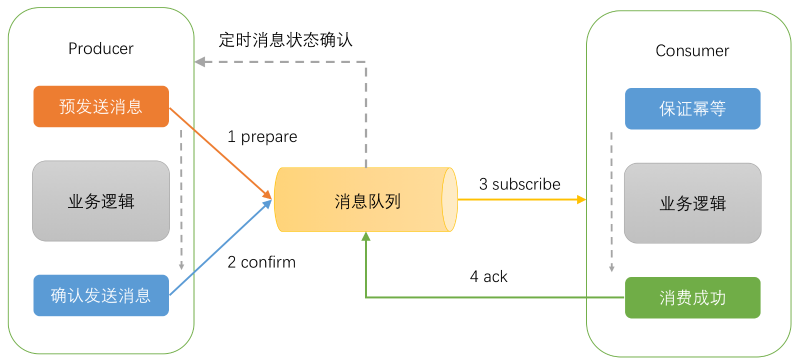

# 分布式系统

---

<!-- TOC -->

- [CAP定理](#CAP定理)
    - [Partition-tolerance分区容错](#Partition-tolerance)
    - [Consistency一致性](#Consistency)
    - [Availability可用性](#Availability)
- [Base理论](#Base理论)
- [柔性事务](#柔性事务)
- [柔性事务实践](#柔性事务实践)

<!-- /TOC -->

---

## CAP定理
> 分布式系统的最大难点，就是各个节点的状态如何同步。CAP 定理是这方面的基本定理，也是理解分布式系统的起点。

1998年，加州大学的计算机科学家 Eric Brewer 提出，分布式系统有三个指标。Consistency Availability Partition tolerance
, 这三个指标不可能同时做到。这个结论就叫做 CAP 定理。

### Partition-tolerance

> 中文叫做"分区容错"

上图中,G1和G2是两台服务即两个区(Partition), G1 向 G2 发送一条消息，G2 可能无法收到。系统设计的时候，必须考虑到这种情况。一般来说，分区容错无法避免，因此可以认为 CAP 的 P 总是成立。CAP 定理告诉我们，剩下的 C 和 A 无法同时做到。

例如: 用户注册服务 通知 用户账户初始化服务, 不是100%一定成功的

### Consistency 

> 中文叫做"一致性", 意思是，写操作之后的读操作，必须返回该值

举例来说，某条记录是 v0，用户向 G1 发起一个写操作，将其改为 v1

接下来，用户的读操作就会得到 v1。这就叫一致性。

***问题是，用户有可能向 G2 发起读操作，由于 G2 的值没有发生变化，因此返回的是 v0。G1 和 G2 读操作的结果不一致，这就不满足一致性了。***

为了让 G2 也能变为 v1，就要在 G1 写操作的时候，让 G1 向 G2 发送一条消息，要求 G2 也改成 v1。

这样的话，用户向 G2 发起读操作，也能得到 v1。

例如: 写库和读库, 但虽有读写同步但还是存在延迟, 不一定读库能取到最新的值

### Availability 

中文叫做"可用性"

> 用户可以选择向 G1 或 G2 发起读操作。不管是哪台服务器，只要收到请求，就必须响应用户，不管值是 v0 还是 v1。

### Consistency和Availability的矛盾
> 一致性和可用性，为什么不可能同时成立？答案很简单，因为可能通信失败（即出现分区容错）。

#### 可用性高于一致性, 最终一致性

举例来说，发布一张网页到 CDN，多个服务器有这张网页的副本。后来发现一个错误，需要更新网页，这时只能每个服务器都更新一遍。

一般来说，网页的更新不是特别强调一致性。短时期内，一些用户拿到老版本，另一些用户拿到新版本，问题不会特别大。当然，所有人最终都会看到新版本。所以，这个场合就是可用性高于一致性。

### 取舍策略

CAP三个特性只能满足其中两个，那么取舍的策略就共有三种：

`CA without P`：如果不要求P（不允许分区），则C（强一致性）和A（可用性）是可以保证的。但放弃P的同时也就意味着放弃了系统的扩展性，也就是分布式节点受限，没办法部署子节点，这是违背分布式系统设计的初衷的。

`CP without A`：如果不要求A（可用），相当于每个请求都需要在服务器之间保持强一致，而P（分区）会导致同步时间无限延长(也就是等待数据同步完才能正常访问服务)，一旦发生网络故障或者消息丢失等情况，就要牺牲用户的体验，等待所有数据全部一致了之后再让用户访问系统。设计成CP的系统其实不少，最典型的就是分布式数据库，如Redis、HBase等。对于这些分布式数据库来说，数据的一致性是最基本的要求，因为如果连这个标准都达不到，那么直接采用关系型数据库就好，没必要再浪费资源来部署分布式数据库。

`AP wihtout C`：要高可用并允许分区，则需放弃一致性。一旦分区发生，节点之间可能会失去联系，为了高可用，每个节点只能用本地数据提供服务，而这样会导致全局数据的不一致性。典型的应用就如某米的抢购手机场景，可能前几秒你浏览商品的时候页面提示是有库存的，当你选择完商品准备下单的时候，系统提示你下单失败，商品已售完。这其实就是先在 A（可用性）方面保证系统可以正常的服务，然后在数据的一致性方面做了些牺牲，虽然多少会影响一些用户体验，但也不至于造成用户购物流程的严重阻塞。

***所以没有最好的策略, 只有最适合的策略***

---

## Base理论
Base 理论是对 CAP 中一致性和可用性权衡的结果，其来源于对大型互联网分布式实践的总结，是基于 CAP 定理逐步演化而来的。其核心思想是：
> 既是无法做到强一致性（Strong consistency），但每个应用都可以根据自身的业务特点，采用适当的方式来使系统达到最终一致性（Eventual consistency）。

### Basically Available(基本可用)
分布式系统在出现故障时，允许 ***损失部分可用性*** ，但是系统还是可用的, 例如: 
- `响应时间上的损失`, 正常情况下的搜索引擎 0.5 秒即返回给用户结果，而基本可用的搜索引擎可以在 1 秒作用返回结果。
- `功能上的损失`, 在一个电商网站上，正常情况下，用户可以顺利完成每一笔订单，但是到了大促期间，为了保护购物系统的稳定性，部分消费者可能会被引导到一个降级页面

###  Soft state（软状态）
什么是软状态呢？相对于原子性而言，要求多个节点的数据副本都是一致的，这是一种 “硬状态”。

软状态指的是：允许系统中的数据存在中间状态，并认为该状态不影响系统的整体可用性，即允许系统在多个不同节点的数据副本存在数据延时。

### Eventually consistent（最终一致性）
不可能一直是软状态，必须有个时间期限。在期限过后，应当保证所有副本保持数据一致性。从而达到数据的最终一致性。这个时间期限取决于网络延时，系统负载，数据复制方案设计等等因素。
> 系统能够保证在没有其他新的更新操作的情况下，数据最终一定能够达到一致的状态，因此所有客户端对系统的数据访问最终都能够获取到最新的值。

### 总结
总的来说，BASE 理论面向的是大型高可用可扩展的分布式系统(互联网企业)，和传统事务的 ACID 是相反的，它完全不同于 ACID 的强一致性模型，而是通过牺牲强一致性来获得可用性，并允许数据在一段时间是不一致的。

---
## 柔性事务
在这之前让回忆下CAP和Base理论, 这都会在做铺垫, 还有与之对立的刚性事务也就是传统事务(原子性（Atomictiy）、一致性（Consistency）、隔离性（Isolation）、持久性（Durabilit）)

在电商领域等互联网场景下，传统的事务在数据库性能和处理能力上都暴露出了瓶颈。在分布式领域基于CAP理论以及BASE理论，有人就提出了 柔性事务 的概念。

柔性事务针对分布式事务的解决方法：

1. `记录日志+补偿`
记录事务的开始和结束状态。事务根据日志记录找回事务的当前执行状态，并根据状态决定重试异常步骤，也就是正向补偿，或者回滚上一次执行步骤，也就是反向补偿。
2. `消息`
多次重试，也就是发送多次消息，由于要多次重发，所以程序必须是幂等（同一操作反复执行多次结果不变），这是非常具有互联网特征的一种模式。
3. `“无锁”设计`
放弃锁是一个解决问题的思路。比如通过乐观锁，大多数是基于版本号来实现。
update goods
set name=#{name},
remaining_number=#{remainingNumber},
version=version+1
where id=#{id} and version=#{version}

---
## 柔性事务实践

### 可靠消息最终一致性RabbitMQ

关于RabbitMQ这里不多做介绍了, 主要说说怎么用RabbitMQ来实现柔性事务
- 高可用部署方案
- 消息持久化
- 消息确认机制

一句话概括: 就是只要把消息交给RabbitMQ就能确保消息在某时一定会发送到消息者, 正确消费后会有回执给到发送者. 

### 可靠消息最终一致性RocketMQ

rocketMQ具有很多其他消息队列不具有的特性, RocketMQ实现事务消息的关键是事务回查

RocketMQ第一阶段发送Prepared消息时，会拿到消息的地址，第二阶段执行本地事物，第三阶段通过第一阶段拿到的地址去访问消息，并修改状态。细心的你可能又发现问题了，如果确认消息发送失败了怎么办？RocketMQ会定期扫描消息集群中的事物消息，这时候发现了Prepared消息，它会向消息发送者确认，钱到底是减了还是没减呢？如果减了是回滚还是继续发送确认消息呢？RocketMQ会根据发送端设置的策略来决定是回滚还是继续发送确认消息。这样就保证了消息发送与本地事务同时成功或同时失败。

如果事务消息发送到MQ上后，事务消息是prepare状态，对消费者还不可见，需要本地事务执行器返回给MQ一个确认消息。事务消息是否对消费者可见完全由本地事务执行器返回的确认消息决定。如果迟迟收不到确认消息，MQ会使用事务回查机制。其实现原理是，事务消息开始是Prepare状态，RocketMQ会将其持久化到本地Mysql中，然后如果收到确认消息，就删除掉这条prepare消息，如果迟迟收不到确认消息，那么RMQ会定时的扫描prepare消息，发送给produce group进行回查确认。

---
## 参考
1. [An Illustrated Proof of the CAP Theorem](https://mwhittaker.github.io/blog/an_illustrated_proof_of_the_cap_theorem/)

