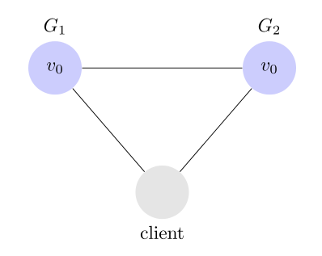

# 分布式系统

---

<!-- TOC -->

- [CAP定理](#CAP定理)
    - [Partition-tolerance分区容错](#Partition-tolerance)
    - [Consistency一致性](#Consistency)
    - [Availability可用性](#Availability)

<!-- /TOC -->

---

## CAP定理
> 分布式系统的最大难点，就是各个节点的状态如何同步。CAP 定理是这方面的基本定理，也是理解分布式系统的起点。

1998年，加州大学的计算机科学家 Eric Brewer 提出，分布式系统有三个指标。Consistency Availability Partition tolerance
, 这三个指标不可能同时做到。这个结论就叫做 CAP 定理。

### Partition-tolerance

> 中文叫做"分区容错"

上图中,G1和G2是两台服务即两个区(Partition), G1 向 G2 发送一条消息，G2 可能无法收到。系统设计的时候，必须考虑到这种情况。一般来说，分区容错无法避免，因此可以认为 CAP 的 P 总是成立。CAP 定理告诉我们，剩下的 C 和 A 无法同时做到。

例如: 用户注册服务 通知 用户账户初始化服务, 不是100%一定成功的

### Consistency 

> 中文叫做"一致性", 意思是，写操作之后的读操作，必须返回该值

举例来说，某条记录是 v0，用户向 G1 发起一个写操作，将其改为 v1

接下来，用户的读操作就会得到 v1。这就叫一致性。

***问题是，用户有可能向 G2 发起读操作，由于 G2 的值没有发生变化，因此返回的是 v0。G1 和 G2 读操作的结果不一致，这就不满足一致性了。***

为了让 G2 也能变为 v1，就要在 G1 写操作的时候，让 G1 向 G2 发送一条消息，要求 G2 也改成 v1。

这样的话，用户向 G2 发起读操作，也能得到 v1。

例如: 写库和读库, 但虽有读写同步但还是存在延迟, 不一定读库能取到最新的值

### Availability 

中文叫做"可用性"

> 用户可以选择向 G1 或 G2 发起读操作。不管是哪台服务器，只要收到请求，就必须响应用户，不管值是 v0 还是 v1。

### Consistency和Availability的矛盾
> 一致性和可用性，为什么不可能同时成立？答案很简单，因为可能通信失败（即出现分区容错）。

#### 可用性高于一致性, 最终一致性

举例来说，发布一张网页到 CDN，多个服务器有这张网页的副本。后来发现一个错误，需要更新网页，这时只能每个服务器都更新一遍。

一般来说，网页的更新不是特别强调一致性。短时期内，一些用户拿到老版本，另一些用户拿到新版本，问题不会特别大。当然，所有人最终都会看到新版本。所以，这个场合就是可用性高于一致性。

### 取舍策略

CAP三个特性只能满足其中两个，那么取舍的策略就共有三种：

`CA without P`：如果不要求P（不允许分区），则C（强一致性）和A（可用性）是可以保证的。但放弃P的同时也就意味着放弃了系统的扩展性，也就是分布式节点受限，没办法部署子节点，这是违背分布式系统设计的初衷的。

`CP without A`：如果不要求A（可用），相当于每个请求都需要在服务器之间保持强一致，而P（分区）会导致同步时间无限延长(也就是等待数据同步完才能正常访问服务)，一旦发生网络故障或者消息丢失等情况，就要牺牲用户的体验，等待所有数据全部一致了之后再让用户访问系统。设计成CP的系统其实不少，最典型的就是分布式数据库，如Redis、HBase等。对于这些分布式数据库来说，数据的一致性是最基本的要求，因为如果连这个标准都达不到，那么直接采用关系型数据库就好，没必要再浪费资源来部署分布式数据库。

`AP wihtout C`：要高可用并允许分区，则需放弃一致性。一旦分区发生，节点之间可能会失去联系，为了高可用，每个节点只能用本地数据提供服务，而这样会导致全局数据的不一致性。典型的应用就如某米的抢购手机场景，可能前几秒你浏览商品的时候页面提示是有库存的，当你选择完商品准备下单的时候，系统提示你下单失败，商品已售完。这其实就是先在 A（可用性）方面保证系统可以正常的服务，然后在数据的一致性方面做了些牺牲，虽然多少会影响一些用户体验，但也不至于造成用户购物流程的严重阻塞。

***所以没有最好的策略, 只有最适合的策略***

## 参考
1. [An Illustrated Proof of the CAP Theorem](https://mwhittaker.github.io/blog/an_illustrated_proof_of_the_cap_theorem/)

