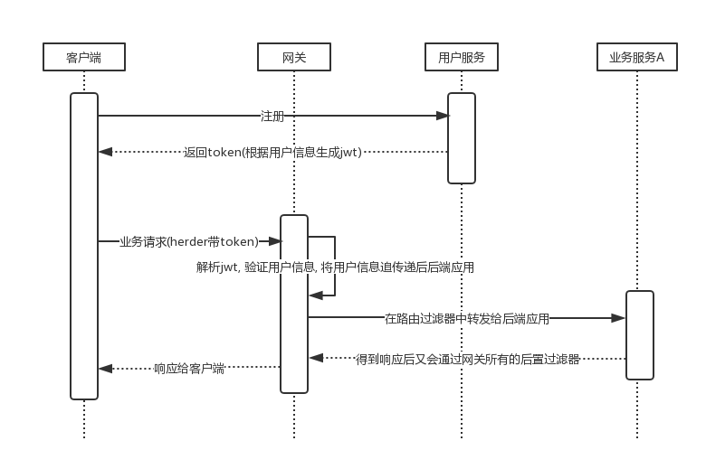

## 背景
新开发的项目使用Spring Cloud技术将系统拆分为多个微服务, 那么用户的登录状态如何在多个服务间同步? 说白了还是单点登录的问题

## 相关技术
JSON Web Token (JWT)

下列场景中使用JSON Web Token是很有用的：

- `Authorization (授权)` : 这是使用JWT的最常见场景。一旦用户登录，后续每个请求都将包含JWT，允许用户访问该令牌允许的路由、服务和资源。单点登录是现在广泛使用的JWT的一个特性，因为它的开销很小，并且可以轻松地跨域使用。
- `Information Exchange (信息交换)` : 对于安全的在各方之间传输信息而言，JSON Web Tokens无疑是一种很好的方式。因为JWTs可以被签名，例如，用公钥/私钥对，你可以确定发送人就是它们所说的那个人。另外，由于签名是使用头和有效负载计算的，您还可以验证内容没有被篡改。

jwt的原理可以百度,使用可以参考下面

1. pom.xml添加依赖
```xml
<dependency>
    <groupId>io.jsonwebtoken</groupId>
    <artifactId>jjwt</artifactId>
    <version>0.9.0</version>
</dependency>
```
2. 生成与解析方法
```java
public class JwtHelper {
    private final static String BASE64_SECRET = "MDk4ZjZiY2Q0NjIxZDM3M2NhZGU0ZTgzMjYyN2I0ZjY=";
    
    private final static long EXPIRE_TIME = 15 * 86400000;
    
    public static Claims parseJWT(String jsonWebToken) {
        return Jwts.parser()
                .setSigningKey(DatatypeConverter.parseBase64Binary(BASE64_SECRET))
                .parseClaimsJws(jsonWebToken).getBody();
    }
    
    public static String createJWT(Map param) {
        Key signingKey = new SecretKeySpec(DatatypeConverter.parseBase64Binary(BASE64_SECRET), SignatureAlgorithm.HS256.getJcaName());
        return Jwts.builder().setHeaderParam("typ", "JWT").setClaims(param).setExpiration(new Date(System.currentTimeMillis() + EXPIRE_TIME))
                .signWith(SignatureAlgorithm.HS256, signingKey).compact();
    }
}
```

## 应用到系统中

带来的好处: 
- 通过网关来统一解析和验证, 类似认证中心
- 抛弃了会话机制和用户登录状态的维护, 这些在多系统中会带来复杂性
- 用户信息可以通过jwt解析得来, 不用每次都访问存储
