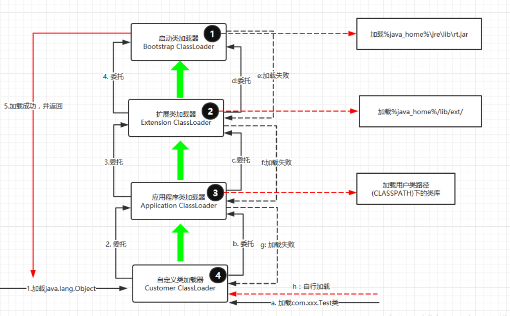

### Tomcat 生命周期
> Lifecycle：定义了容器生命周期、容器状态转换及容器状态迁移事件的监听器注册和移除等主要接口；

两个关键点: 
1. 状态变量和方法init() start() stop() destroy()实现了一个组件的生命周期管理
2. addLifecycleListener() removeLifecycleListener()利用观察者模式实现了自身状态变更后通知其他观察者

**PS: 对组件生命周期的管理在很多场景都用的上**

## Tomcat 类加载机制

几个思考:

1. tomcat的类加载器有几个? 各自的职责?
2. 为什么每个应用都要求自定义类加载器?

